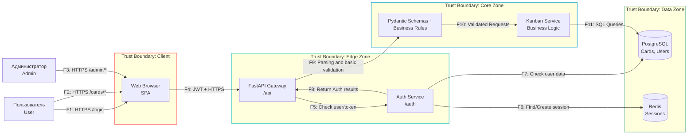

# Data Flow Diagram - Idea Kanban

```mermaid
flowchart LR
  %% External Entities
  USER[Пользователь\nUser]
  ADMIN[Администратор\nAdmin]

  %% Trust Boundary: Client
  subgraph CLIENT [Trust Boundary: Client]
    WEB[Web Browser\nSPA]
  end

  %% Trust Boundary: Edge
  subgraph EDGE [Trust Boundary: Edge Zone]
    API[FastAPI Gateway\n/api]
    AUTH[Auth Service\n/auth]
  end

  %% Trust Boundary: Core
  subgraph CORE [Trust Boundary: Core Zone]
    APP[Kanban Service\nBusiness Logic]
    VALID[Pydantic Schemas +<br/>Business Rules]
  end

  %% Trust Boundary: Data
  subgraph DATA [Trust Boundary: Data Zone]
    DB[(PostgreSQL\nCards, Users)]
    CACHE[(Redis\nSessions)]
  end

  %% Data Flows
  USER -->|F1: HTTPS /login| WEB
  USER -->|F2: HTTPS /cards/*| WEB
  ADMIN -->|F3: HTTPS /admin/*| WEB

  WEB -->|F4: JWT + HTTPS| API

  %%Auth
  API --> |F5: Check user/token| AUTH
  AUTH --> |F6: Find/Create session| CACHE
  AUTH --> |F7: Check user data| DB
  AUTH --> |F8: Return Auth results| API

  API -->|F9: Parsing and basic validation| VALID
  VALID -->|F10: Validated Requests| APP
  APP -->|F11: SQL Queries| DB


  %% Styling
  style CLIENT stroke:#ff6b6b,stroke-width:2px
  style EDGE stroke:#4ecdc4,stroke-width:2px
  style CORE stroke:#45b7d1,stroke-width:2px
  style DATA stroke:#96ceb4,stroke-width:2px
```
